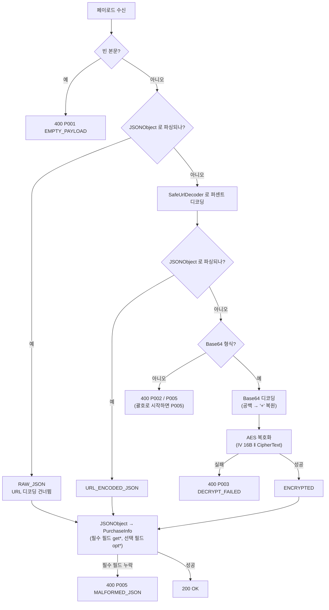

# URL Decoder 트러블슈팅 랩

외부 기기(단말기, POS 등)가 보낸 물품 구매 정보 페이로드를 서버에서 복원하는 과정에서 발생한
**`java.net.URLDecoder` 오적용 문제**를 재현하고 해결하기 위한 실험 프로젝트.

| # | 문제 | 증상 |
|---|---|---|
| **1** | `%` 문자 hex 오류 | `"discountRate":"10%"` 같은 값에서 `IllegalArgumentException` 발생 → 요청 전체 실패 |
| **2** | `+` 문자 공백 치환 | `"customerPhone":"+821012345678"` 이 `" 821012345678"` 로 조용히 오염 |
| **3** | Base64 디코딩 실패 | 2번의 연쇄 피해. `+` 가 공백이 된 Base64가 `Last unit does not have enough valid bits` 로 실패 |
| **4** | `form-urlencoded` 500 | `@RequestBody` 가 본문 대신 파라미터 맵에서 본문을 재구성해 `Required request body is missing` |

1번은 요청이 터지므로 바로 발견되지만, **2번이 더 위험하다.** 예외 없이 통과한 뒤 잘못된 전화번호가
DB에 저장되기 때문이다. 3·4번은 전체 흐름을 재검토하며 추가로 찾아낸 것으로,
[3.5](#35-문제-3--base64-디코딩-단계에서-터지는-경우) · [3.6](#36-문제-4--form-urlencoded-요청이-500이-되는-경우) 에 정리했다.

---

## 목차

1. [배경: 원래 파이프라인](#1-배경-원래-파이프라인)
2. [개념 정리](#2-개념-정리)
3. [트러블슈팅](#3-트러블슈팅)
4. [최종 설계](#4-최종-설계)
5. [API 명세](#5-api-명세)
6. [실행 및 테스트](#6-실행-및-테스트)
7. [프로젝트 구조](#7-프로젝트-구조)
8. [부록: 빌드 환경 트러블슈팅](#8-부록-빌드-환경-트러블슈팅)

---

## 1. 배경: 원래 파이프라인

단말기는 구매 정보 JSON을 AES로 암호화하고 Base64로 감싸서 전송한다.
Base64 알파벳에는 `+`, `/`, `=` 가 포함되므로 전송 구간에서 퍼센트 인코딩(URL 인코딩)될 수 있다.
따라서 서버의 복원 순서는 다음과 같다.

```
[단말기]  JSON → AES 암호화 → Base64 인코딩 → (URL 인코딩은 선택) → 전송
                                                    │
[서버]    수신 → URL 디코딩 → Base64 디코딩 → AES 복호화 → JSON
                   ①②            ③
```

`①②③` 은 각각 [문제 1·2](#31-문제-1--문자-hex-오류) 와 [문제 3](#35-문제-3--base64-디코딩-단계에서-터지는-경우) 이 터지는 지점이다.
URL 디코딩이 Base64 문자열에 적용된다는 점에 주목하자 — **단말기가 URL 인코딩을 생략하면
Base64의 `+` 가 그대로 도착하는데, 서버가 `URLDecoder` 를 태우면서 이것을 공백으로 바꿔
Base64 디코딩까지 연쇄로 무너진다.**

문제는 **일부 단말기/펌웨어가 암호화 없이 JSON 원문을 그대로 보낸다**는 점이다.
이 JSON 원문이 URL 디코딩 단계로 들어가면서 위 두 문제가 터진다.

```java
// 기존 코드 — 형태 구분 없이 무조건 URLDecoder 적용
String decoded = URLDecoder.decode(payload, StandardCharsets.UTF_8); // 💥
```

---

## 2. 개념 정리

### 2.1 퍼센트 인코딩 (URL 인코딩)

URL에 그대로 쓸 수 없는 문자를 `%` + 16진수 2자리로 바꾸는 방식이다.
UTF-8 멀티바이트 문자는 **바이트 단위로 쪼개져 각각 인코딩**된다.

| 원문 | UTF-8 바이트 | 인코딩 결과 |
|---|---|---|
| `{` | `7B` | `%7B` |
| `"` | `22` | `%22` |
| `한` | `ED 95 9C` | `%ED%95%9C` |

디코딩할 때 `%ED%95%9C` 를 한 글자씩 따로 변환하면 깨진다.
**연속된 `%XX` 를 바이트 버퍼에 모아두었다가 한 번에 UTF-8로 변환해야 한다.**
(이 프로젝트의 `SafeUrlDecoder` 가 그렇게 구현되어 있다.)

### 2.2 핵심: RFC 3986 vs `application/x-www-form-urlencoded`

**"URL 인코딩"이라 부르는 규격은 사실 두 개**이고, 이 둘의 차이가 이번 버그의 근본 원인이다.

| 항목 | RFC 3986 (URI 일반) | `x-www-form-urlencoded` (HTML 폼) |
|---|---|---|
| `+` 의 의미 | **리터럴 플러스 문자** | **공백** |
| 공백 표현 | `%20` | `+` (또는 `%20`) |
| 용도 | URI의 path, query 등 일반 컴포넌트 | HTML 폼 전송 본문 |

`java.net.URLDecoder` 는 **후자(폼 규격)의 구현체다.** Javadoc에도 명시되어 있다.

> Decodes a `application/x-www-form-urlencoded` string using a specific encoding scheme.

즉 `URLDecoder` 는 "URL 디코더"라는 이름과 달리 **범용 URL 디코더가 아니다.**
폼 데이터가 아닌 것(JSON 원문, Base64 문자열)에 쓰면 규격상 당연히 오작동한다.

> **정리**: 이번 버그는 라이브러리 버그가 아니라 **규격 오적용**이다.
> 폼 전송이 아닌 페이로드에 폼 디코더를 썼기 때문에 발생했다.

### 2.3 Base64와 URL 인코딩의 관계

표준 Base64 알파벳은 `A–Z a–z 0–9 + / =` 이다.
이 중 **`+`, `/`, `=` 세 개가 URL에서 특별한 의미**를 가지므로 전송 시 인코딩이 필요하다.

| 문자 | 퍼센트 인코딩 | URL-safe Base64 대체 문자 |
|---|---|---|
| `+` | `%2B` | `-` |
| `/` | `%2F` | `_` |
| `=` | `%3D` | (패딩 생략) |

여기서 **`+` 가 두 문제의 교차점**이 된다.

- 단말기가 URL 인코딩을 **하면**: `+` → `%2B` 로 안전하게 전달된다.
- 단말기가 URL 인코딩을 **생략하면**: `+` 가 그대로 들어오고, `URLDecoder` 가 이를 공백으로 바꾼다.
  → Base64 문자열이 깨지고 → **AES 복호화까지 연쇄 실패**한다.

이 프로젝트의 `Base64Codec` 은 표준/URL-safe 알파벳, 패딩 누락, 줄바꿈 혼입을 모두 흡수한다.

### 2.4 AES/CBC와 IV

CBC 모드는 같은 평문이 항상 같은 암호문이 되는 것을 막기 위해 **IV(Initialization Vector)** 를 쓴다.
IV는 비밀값이 아니므로 암호문과 함께 전송해도 되며, 이 프로젝트는 관례대로
**암호문 앞 16바이트에 IV를 붙이는** 방식을 쓴다.

```
전송 바이트 = [ IV(16 bytes) ‖ CipherText ]
페이로드    = Base64(전송 바이트)
```

같은 평문을 두 번 암호화하면 IV가 달라 결과 Base64도 달라진다
(`AesCipherTest.randomIvProducesDifferentCipherText` 에서 검증).

---

## 3. 트러블슈팅

### 3.1 문제 1 — `%` 문자 hex 오류

#### 증상

```java
String rawJson = "{\"discountRate\":\"10%\"}";
URLDecoder.decode(rawJson, StandardCharsets.UTF_8);
```

```
java.lang.IllegalArgumentException: URLDecoder: Illegal hex characters in escape (%) pattern
    - not a hexadecimal digit: """ = 34
```

문자열 맨 끝에 `%` 가 오면 메시지가 다르다.

```java
URLDecoder.decode("100%", StandardCharsets.UTF_8);
// java.lang.IllegalArgumentException: URLDecoder: Incomplete trailing escape (%) pattern
```

#### 원인

`URLDecoder` 는 `%` 를 만나면 **반드시 이스케이프 시퀀스의 시작으로 간주**하고
뒤의 2글자를 16진수로 파싱한다. 실패하면 예외를 던진다.

하지만 JSON 원문의 `%` 는 이스케이프가 아니라 **사용자가 입력한 리터럴 문자**다.
`"10%"`(할인율), `"적립률 5%"`(메모) 처럼 실무 데이터에 자연스럽게 등장한다.

#### 해결

`%` 뒤가 16진수 2자리가 아니면 **이스케이프가 아닌 리터럴 `%` 로 취급**하고 그대로 보존한다.
예외를 던지지 않는다.

```java
int octet = readOctet(value, index);
if (octet < 0) {
    // %XX 형태가 아니다 → 리터럴 '%' 로 취급
    flush(bytes, decoded, charset);
    decoded.append(ESCAPE);
    index++;
    continue;
}
```

깨진 `%` 와 정상 `%XX` 가 섞여 있어도 **정상 이스케이프만 골라서 푼다.**

```java
SafeUrlDecoder.decode("a%25b%c");  // → "a%b%c"
//                      ^^^         %25 는 '%' 로 디코딩
//                          ^       뒤가 'c' 뿐이라 리터럴 '%' 로 보존
```

> **주의**: `Character.digit(c, 16)` 을 쓰면 전각 숫자(`％２５`) 같은 비-ASCII 문자도
> 16진수로 인정해버린다. 판별을 엄격하게 하려고 ASCII만 받는 `hexValue()` 를 직접 구현했다.

### 3.2 문제 2 — `+` 문자가 공백으로 치환

#### 증상

예외가 없다. **조용히 데이터가 오염된다.**

```java
URLDecoder.decode("{\"customerPhone\":\"+821012345678\"}", UTF_8);
// → {"customerPhone":" 821012345678"}   ← '+' 가 공백이 됨

URLDecoder.decode("ab+cd/ef+gh==", UTF_8);
// → ab cd/ef gh==                       ← Base64 파괴
```

#### 원인

[2.2](#22-핵심-rfc-3986-vs-applicationx-www-form-urlencoded) 에서 설명한 대로,
`URLDecoder` 가 구현한 폼 규격에서 `+` 는 공백이다. 반면 우리 페이로드에서 `+` 는

- **국제전화번호**의 국가번호 접두사 (`+8210...`)
- **Base64 알파벳**의 62번 문자
- 일반 텍스트 (`"C+ 등급 회원"`)

로 쓰이는 **리터럴 문자**다.

#### 해결

RFC 3986 규격을 따라 **`+` 를 변환하지 않고 그대로 보존**한다.
공백은 `%20` 으로만 해석한다.

```java
SafeUrlDecoder.decode("a+b%20c");   // → "a+b c"
//                      ^             '+' 는 그대로
//                         ^^^        %20 만 공백으로
```

### 3.3 기각한 대안들

문제를 발견하고 바로 떠올린 해법들이 왜 부족한지 정리한다.

#### ❌ 대안 1 — try-catch 로 감싸고 실패하면 원문 사용

```java
try {
    return URLDecoder.decode(payload, UTF_8);
} catch (IllegalArgumentException e) {
    return payload;  // 실패하면 원문 그대로
}
```

**문제 1은 막지만 문제 2는 전혀 막지 못한다.** 오히려 가장 위험한 선택이다.
`{"customerPhone":"+821012345678"}` 처럼 **깨진 `%` 없이 `+` 만 있는 페이로드**는
예외가 나지 않으므로 catch에 걸리지 않고, 오염된 결과가 정상인 것처럼 반환된다.

#### ❌ 대안 2 — `%` 를 `%25` 로 미리 치환한 뒤 디코딩

```java
return URLDecoder.decode(payload.replace("%", "%25"), UTF_8);
```

JSON 원문에는 통하지만 **정상 규격 페이로드를 깨뜨린다.**

```
%7B%22a%22%7D  →  %257B%2522a%2522%257D  →  디코딩  →  %7B%22a%22%7D
```

디코딩 결과가 원래 인코딩된 문자열 그대로다. 한 겹도 풀리지 않았다.
게다가 `+` 문제는 여전히 남아 있다.

#### ❌ 대안 3 — URL 디코딩을 아예 제거

JSON 원문은 잘 처리되지만, **정상 규격(URL 인코딩된 Base64)을 처리할 수 없다.**
`%2B`, `%2F`, `%3D` 가 풀리지 않아 Base64 디코딩이 실패한다.

#### ✅ 채택 — 형태 판별 + RFC 3986 관대한 디코더 (2중 방어)

디코더 자체를 규격에 맞게 고치고(**`SafeUrlDecoder`**),
그 앞단에서 **페이로드 형태를 먼저 판별**해 불필요한 디코딩 자체를 건너뛴다.

### 3.4 왜 디코더를 고치는 것만으로 부족한가

`SafeUrlDecoder` 는 `%` 예외와 `+` 오염을 모두 막지만, **그것만으로는 여전히 데이터가 훼손될 수 있다.**

사용자가 메모에 실제로 `쿠폰코드 100%25` 라고 입력한 경우를 보자.

```java
String json = "{\"memo\":\"쿠폰코드 100%25\"}";
SafeUrlDecoder.decode(json);
// → {"memo":"쿠폰코드 100%"}    ← %25 가 '%' 로 풀려버림. 원본 훼손!
```

`%25` 는 형태상 완벽히 유효한 이스케이프라서 관대한 디코더도 이것을 풀어버린다.
**애초에 URL 인코딩되지 않은 데이터에는 디코딩을 시도하면 안 된다**는 뜻이다.

그래서 `PurchasePayloadDecoder` 는 디코딩 **이전에** 형태를 판별하고,
JSON 원문이면 **URL 디코딩 단계를 통째로 건너뛴다.**

```java
// 1) JSON 원문 — URL 디코딩 자체를 건너뛴다.
if (looksLikeJson(trimmed)) {
    return DecodedPayload.of(PayloadFormat.RAW_JSON, trimmed);
}
```

판별은 **`JSONObject` 파싱을 실제로 시도해서** 한다. 괄호 모양을 세는 휴리스틱보다 정확하고,
앞뒤 공백·줄바꿈도 파서가 알아서 처리하므로 별도 정리가 필요 없다.

```java
/** JSON 객체로 파싱되면 반환하고, 아니면 null. 괄호 휴리스틱 대신 파서에게 직접 묻는다. */
private JSONObject parseOrNull(String value) {
    try {
        JSONTokener tokener = new JSONTokener(value);
        JSONObject json = new JSONObject(tokener);
        return tokener.nextClean() == 0 ? json : null;
    } catch (JSONException e) {
        return null;
    }
}
```

Base64 문자열은 `{` 로 시작할 수 없으므로 **JSON으로 오인될 여지가 원천적으로 없다.**
`+` 로 시작하는 Base64도 마찬가지다. (실측으로 확인)

> **`nextClean() == 0` 검사가 필요한 이유**: `new JSONObject(String)` 은 객체 하나를 읽고
> **뒤에 남은 내용을 조용히 무시한다.** 본문을 스트림에 직접 write하는 단말기에서 페이로드가
> 두 번 써져 `{...}{...}` 로 이어붙으면 앞의 하나만 취하고 나머지를 잃는다.
> 문자열을 끝까지 소비했는지 확인해 이런 **조용한 데이터 손실**을 막는다.

### 3.5 문제 3 — Base64 디코딩 단계에서 터지는 경우

전체 흐름을 재검토하면서 찾은 문제다. 문제 2(`+` → 공백)의 **연쇄 피해**에 해당한다.

#### 증상

```
java.lang.IllegalArgumentException: Last unit does not have enough valid bits
```

#### 원인

우리 코드가 `SafeUrlDecoder` 를 쓰더라도, **페이로드가 우리에게 도달하기 전에 이미 `+` 가 공백으로
바뀌어 있을 수 있다.** 레거시 `URLDecoder` 를 쓰는 앞단 모듈, 서블릿 컨테이너의 폼 파싱,
일부 프록시가 그 주범이다.

이때 Base64 문자열은 이런 상태가 된다.

```
원본   Rz73ujo8GtEWroNZM0PoJEW4xL7RVj2/3Kzp365Y0rpO7P+I8vYP...
훼손   Rz73ujo8GtEWroNZM0PoJEW4xL7RVj2/3Kzp365Y0rpO7P I8vYP...
                                                    ↑ '+' 가 공백
```

여기서 **공백을 "제거"하면 문자열 길이가 줄어** Base64 4바이트 정렬이 깨지고,
위 예외가 발생한다. 초기 구현이 `value.replaceAll("\\s", "")` 로 공백을 제거하고 있어
**복구 가능한 페이로드를 오히려 하드 실패로 만들고 있었다.**

#### 해결

**Base64 알파벳(`A–Z a–z 0–9 + / =`)에는 공백이 없다.** 따라서 문자열에 나타난 공백은
`+` 가 치환된 흔적일 가능성이 높다. 제거하는 대신 **`+` 로 되돌린다.**

다만 공백은 단순한 여백일 수도 있어 모호하므로, 순서대로 두 번 시도한다.

```java
// 줄바꿈·탭은 Base64 알파벳에도 없고 '+'로 오해될 여지도 없으므로 먼저 제거한다.
String cleaned = value.replaceAll("[\\r\\n\\t\\f\\x0B]", "");

try {
    return decodeStrict(cleaned.replace(' ', '+'));   // 1순위: 훼손된 '+' 로 본다
} catch (IllegalArgumentException e) {
    return decodeStrict(cleaned.replace(" ", ""));    // 2순위: 단순 여백으로 본다
}
```

`+` 로 잘못 복원하면 길이·패딩이 어긋나 1순위가 실패하므로, 2순위가 안전망이 된다.
**MIME Base64의 줄바꿈은 `\r\n` 이지 공백이 아니므로** 서식 문자는 그대로 제거해도 안전하다.

#### 함정: 파이프라인의 `strip()` 이 선두 공백을 지웠다

`Base64Codec` 을 고친 뒤 단위 테스트는 통과했지만, **실제 서버에 요청하니 여전히 400이 났다.**
Base64가 `+` 로 **시작**하는 경우였다.

```
원본   +/8ARz73ujo8...
훼손    /8ARz73ujo8...     ← 선두 '+' 가 공백
```

당시 파이프라인이 형태 판별을 위해 `payload.strip()` 을 호출하고 있어서, `Base64Codec` 이
손쓰기도 전에 **선두 공백이 지워지고 있었다.**

이 문제는 형태 판별을 `JSONObject` 파싱으로 바꾸면서 **자연히 사라졌다.** 파서가 앞뒤 공백을
스스로 처리하므로 파이프라인에서 `strip()` 을 할 이유가 없어졌고, 페이로드는 손대지 않은 채
`Base64Codec` 까지 그대로 전달된다. 공백 복원 책임이 `Base64Codec` 한 곳에만 남는다.

> **교훈**: 단위 테스트가 `Base64Codec.decode()` 를 **직접** 호출했기 때문에 파이프라인 앞단의
> `strip()` 을 우회해서 통과했다. 컴포넌트 단위 테스트만으로는 이런 **계층 간 상호작용 버그**를
> 잡을 수 없다. 실제 서버에 요청을 쏴 보는 검증이 필요하다.

### 3.6 문제 4 — `form-urlencoded` 요청이 500이 되는 경우

#### 증상

`Content-Type: application/x-www-form-urlencoded` 로 JSON 원문을 보내면 500이 떨어진다.

```
HttpMessageNotReadableException: Required request body is missing:
    ... PurchaseController.receive(java.lang.String)
```

#### 원인

`@RequestBody String` 은 내부적으로 `ServletServerHttpRequest.getBody()` 를 타는데,
이 메서드에는 **form POST 전용 분기**가 있다.

```java
public InputStream getBody() throws IOException {
    if (isFormPost(this.servletRequest)) {
        return getBodyFromServletRequestParameters(this.servletRequest);  // ← 본문이 아니라 파라미터 맵
    }
    return this.servletRequest.getInputStream();
}
```

즉 `Content-Type` 이 form-urlencoded면 **원본 본문 대신 파라미터 맵에서 본문을 재구성**한다.
서블릿 컨테이너가 폼 파싱을 하며 스트림을 소비해버리기 때문에 만들어진 우회로인데, 우리 입장에서는

- JSON 원문처럼 `name=value&...` 구조가 아닌 본문은 파라미터로 잡히지 않아 **본문이 통째로 사라지고**,
- 폼 파싱 규격상 **`+` 가 공백으로 바뀐다** (문제 2가 프레임워크 레벨에서 재발)

는 이중 피해를 입는다.

#### 해결

단말기가 어떤 `Content-Type` 을 보내든 **보낸 바이트 그대로** 받아야 하므로,
`@RequestBody` 를 버리고 **원시 입력 스트림을 직접 읽는다.**

```java
@PostMapping(consumes = MediaType.ALL_VALUE, produces = MediaType.APPLICATION_JSON_VALUE)
public PurchaseResponse receive(HttpServletRequest request) {
    return purchaseService.receive(readRawBody(request));
}

private String readRawBody(HttpServletRequest request) {
    try {
        return StreamUtils.copyToString(request.getInputStream(), resolveCharset(request));
    } catch (IOException e) {
        throw new PayloadException(ErrorCode.EMPTY_PAYLOAD, e);
    }
}
```

우리가 먼저 스트림을 읽으므로 컨테이너의 폼 파싱이 트리거되지 않고, 원본 바이트가 보존된다.

---

## 4. 최종 설계

### 4.1 복원 흐름



### 4.2 지원하는 3가지 페이로드 형태

| `format` | 입력 예시 | 처리 |
|---|---|---|
| `RAW_JSON` | `{"orderId":"A-1","discountRate":"10%"}` | **디코딩 없이 그대로** (write 방식으로 보낸 UTF-8 원문) |
| `URL_ENCODED_JSON` | `%7B%22orderId%22%3A%22A-1%22%7D` | 안전 URL 디코딩 |
| `ENCRYPTED` | `Base64(IV‖AES(JSON))` | 안전 URL 디코딩 → Base64 → AES 복호화 |

JSON 배열(`[...]`)은 받지 않는다. 이 엔드포인트는 구매 **한 건**을 받으므로,
배열이 오면 `P005` 로 거부해 연동 실수를 조기에 드러낸다.

응답에 `format` 을 함께 내려주므로, 운영 중 **어떤 단말기가 어떤 형태로 보내는지 분포를 관찰**할 수 있다.

### 4.3 핵심 컴포넌트

| 클래스 | 역할 |
|---|---|
| `SafeUrlDecoder` | **`URLDecoder` 대체.** RFC 3986 기준 관대한 퍼센트 디코더. 어떤 입력에도 예외를 던지지 않는다 |
| `PurchasePayloadDecoder` | **`JSONObject` 파싱으로 형태 판별** 후 복원 경로 결정 (2중 방어의 바깥쪽) |
| `Base64Codec` | 단말기별 Base64 방언(URL-safe, 패딩 누락, 줄바꿈) 흡수 + **공백 → `+` 복원** |
| `AesCipher` | AES/CBC/PKCS5Padding, IV를 암호문 앞에 붙이는 방식 |
| `PurchaseController` | `@RequestBody` 대신 **원시 입력 스트림**을 **UTF-8 고정**으로 읽는다 |

각 컴포넌트가 **책임을 하나씩만** 맡는다. 형태 판별은 파서에게, 공백 복원은 `Base64Codec` 에,
`%`/`+` 보존은 `SafeUrlDecoder` 에 있고 서로 겹치지 않는다.

### 4.4 한글 깨짐 방지 — 본문을 항상 UTF-8로 읽는다

단말기 규약이 UTF-8이므로 `Content-Type` 의 `charset` 선언을 **따르지 않는다.**
charset을 생략하거나 `ISO-8859-1` 로 잘못 선언해놓고 실제로는 UTF-8 바이트를 보내는 단말기가
있는데, 그 선언을 따르면 한글이 깨진다.

```java
private String readRawBody(HttpServletRequest request) {
    try {
        return StreamUtils.copyToString(request.getInputStream(), StandardCharsets.UTF_8);
    } catch (IOException e) {
        throw new PayloadException(ErrorCode.EMPTY_PAYLOAD, e);
    }
}
```

`request.getCharacterEncoding()` 에 의존하지 않는 이유도 같다. 그 값은
`server.servlet.encoding.force-request` 설정에 좌우되므로 **설정이 바뀌면 조용히 깨진다.**
여기서 UTF-8을 고정하면 설정과 무관하게 동작이 보장된다.
(만약 EUC-KR 단말기를 지원해야 한다면 이 지점만 바꾸면 된다.)

### 4.5 `SafeUrlDecoder` 동작 요약

| 입력 | `URLDecoder` | `SafeUrlDecoder` |
|---|---|---|
| `{"discountRate":"10%"}` | 💥 `IllegalArgumentException` | ✅ 원문 그대로 |
| `100%` | 💥 `Incomplete trailing escape` | ✅ `100%` |
| `%zz` / `%2` | 💥 예외 | ✅ 원문 그대로 |
| `+821012345678` | ⚠️ `" 821012345678"` | ✅ `+821012345678` |
| `ab+cd/ef+gh==` | ⚠️ `ab cd/ef gh==` | ✅ 원문 그대로 |
| `a+b%20c` | `a b c` | ✅ `a+b c` |
| `%7B%22a%22%7D` | `{"a"}` | ✅ `{"a"}` (동일) |
| `%ED%95%9C%EA%B8%80` | `한글` | ✅ `한글` (동일) |
| `a%25b%c` | 💥 예외 | ✅ `a%b%c` |

> 정상적으로 인코딩된 입력에 대해서는 `URLDecoder` 와 결과가 같다. **`+` 해석만 규격상 다르다.**

---

## 5. API 명세

### `POST /api/purchases`

본문을 `String` 으로 그대로 받는다. 암호문·URL 인코딩 문자열·JSON 원문이 모두 들어오므로
Jackson이 먼저 파싱하게 두면 안 되고, 형태 판별을 애플리케이션이 직접 해야 하기 때문이다.
`Content-Type` 은 `application/json`, `text/plain` 등 무엇이든 받는다.

#### 요청 예시

```bash
curl -X POST localhost:8080/api/purchases \
  -H 'Content-Type: application/json' \
  -d '{"orderId":"20260811-0001","productName":"아메리카노 (톨)","quantity":2,
       "amount":9000,"discountRate":"10%","customerPhone":"+821012345678",
       "memo":"C+ 등급 회원, 적립률 5%","purchasedAt":"2026-08-11T10:15:30"}'
```

#### 응답 (200 OK)

```json
{
  "format": "RAW_JSON",
  "formatDescription": "JSON 원문",
  "purchase": {
    "orderId": "20260811-0001",
    "productName": "아메리카노 (톨)",
    "quantity": 2,
    "amount": 9000,
    "discountRate": "10%",
    "customerPhone": "+821012345678",
    "memo": "C+ 등급 회원, 적립률 5%",
    "purchasedAt": "2026-08-11T10:15:30"
  }
}
```

`discountRate` 의 `%` 가 살아 있고, `customerPhone` 의 `+` 가 공백으로 바뀌지 않았다.

#### 에러 응답

```json
{
  "timestamp": "2026-08-11T00:49:07.721191",
  "code": "P002",
  "message": "페이로드를 JSON으로 해석할 수 없습니다. (JSON도 Base64도 아닙니다. 앞 32자=이건 그냥 평문입니다!!)"
}
```

| 코드 | HTTP | 의미 |
|---|---|---|
| `P001` | 400 | 요청 본문이 비어 있음 |
| `P002` | 400 | JSON도 Base64도 아니라 해석 불가 |
| `P003` | 400 | AES 복호화 실패 (키 불일치, 손상된 암호문 등) |
| `P004` | 500 | AES 암호화 실패 |
| `P005` | 400 | JSON 구조 오류 |
| `C500` | 500 | 그 외 서버 내부 오류 |

---

## 6. 실행 및 테스트

### 실행

```bash
./gradlew bootRun

# 8080 포트가 이미 사용 중이면
./gradlew bootRun --args='--server.port=8099'
```

### 설정 (`application.yml`)

```yaml
url:
  aes:
    # 단말기와 공유하는 대칭키. 16/24/32바이트만 허용 (아래는 AES-256용 32바이트)
    key: ${AES_KEY:0123456789abcdef0123456789abcdef}
```

기본값은 **개발용 더미 키**다. 운영에서는 `AES_KEY` 환경변수로 주입한다.
길이가 16/24/32바이트가 아니면 애플리케이션 기동 시점에 `IllegalStateException` 으로 막는다.
(런타임에 복호화 실패로 발견되는 것보다 낫다.)

### 테스트

```bash
./gradlew test
```

**64개 테스트 전부 통과.** 구성은 다음과 같다.

| 테스트 클래스 | 초점 |
|---|---|
| `SafeUrlDecoderTest` | `%` / `+` 문제를 **`URLDecoder` 로 먼저 재현한 뒤** 대조 검증 |
| `Base64CodecTest` | 표준/URL-safe, 패딩 누락, 줄바꿈 혼입, **공백 → `+` 복원** |
| `AesCipherTest` | 왕복 암복호화, IV 랜덤성, 키 길이·오키 검증 |
| `PurchasePayloadDecoderTest` | 3가지 형태 판별 및 복원, 훼손 Base64 복구, 이어붙은 페이로드 거부 |
| `PurchaseControllerTest` | `@SpringBootTest` + MockMvc E2E, **form-urlencoded · 한글/charset 회귀** |

테스트는 **버그를 먼저 재현하고 나서 해결을 확인**하는 구조로 작성했다.
회귀가 생기면 어느 쪽이 깨졌는지 바로 드러난다.

```java
@Test
@DisplayName("URLDecoder는 '10%'에서 IllegalArgumentException을 던진다 (재현)")
void urlDecoder_throws_onInvalidHex() {
    String rawJson = "{\"discountRate\":\"10%\"}";

    assertThatThrownBy(() -> URLDecoder.decode(rawJson, StandardCharsets.UTF_8))
            .isInstanceOf(IllegalArgumentException.class)
            .hasMessageContaining("Illegal hex characters");
}

@Test
@DisplayName("SafeUrlDecoder는 예외 없이 원문을 그대로 보존한다")
void safeUrlDecoder_keepsLiteralPercent() {
    String rawJson = "{\"discountRate\":\"10%\"}";

    assertThat(SafeUrlDecoder.decode(rawJson)).isEqualTo(rawJson);
}
```

### 실서버 검증 (권장)

[3.5의 함정](#함정-파이프라인의-strip-이-선두-공백을-지운다)에서 보듯 **단위 테스트만으로는 계층 간 상호작용
버그를 놓친다.** MockMvc의 폼 파싱 동작도 실제 Tomcat과 다르므로, 실제 서버에 요청을 쏴 보는 검증을 권한다.

특히 **`openssl` 로 페이로드를 만들면 우리 코드의 자체 왕복이 아니라 외부 AES 구현과의 호환성**을
확인할 수 있다. 단말기가 표준 AES-256-CBC를 쓴다는 가정을 실제로 검증하는 셈이다.

```bash
KEYHEX=$(printf '%s' '0123456789abcdef0123456789abcdef' | xxd -p | tr -d '\n')
IVHEX=$(openssl rand -hex 16)

printf '%s' '{"orderId":"A-1","productName":"커피","quantity":2,"amount":9000,
              "discountRate":"10%","customerPhone":"+821012345678"}' > plain.txt

openssl enc -aes-256-cbc -K "$KEYHEX" -iv "$IVHEX" -in plain.txt -out ct.bin
printf '%s' "$IVHEX" | xxd -r -p > payload.bin && cat ct.bin >> payload.bin
B64=$(base64 -i payload.bin | tr -d '\n')

curl -X POST localhost:8080/api/purchases -H 'Content-Type: text/plain' --data-binary "$B64"
```

검증해야 할 조합은 다음과 같다. **모두 200이어야 한다.**

| 케이스 | Content-Type |
|---|---|
| JSON 원문 | `application/json` |
| JSON 원문 | `application/x-www-form-urlencoded` ← 문제 4 |
| 원시 Base64(`+` 포함) | `text/plain` |
| 원시 Base64(`+` 포함) | `application/x-www-form-urlencoded` ← 문제 4 |
| `+` 가 공백으로 훼손된 Base64 | `text/plain` ← 문제 3 |
| **선두** `+` 가 공백으로 훼손된 Base64 | `text/plain` ← 문제 3의 함정 |
| URL 인코딩된 Base64 | `application/x-www-form-urlencoded` |
| MIME 줄바꿈이 섞인 Base64 | `text/plain` |

---

## 7. 프로젝트 구조

```
src/main/java/com/laboratory/url/
├── UrlApplication.java
├── api/
│   ├── controller/PurchaseController.java   # 원시 스트림을 UTF-8 고정으로 수신
│   ├── dto/
│   │   ├── PurchaseInfo.java                # % 와 + 를 담는 필드 보유
│   │   └── PurchaseResponse.java            # 판별된 format 을 함께 반환
│   └── service/PurchaseService.java         # JSONObject → PurchaseInfo 매핑
└── common/
    ├── codec/
    │   ├── SafeUrlDecoder.java              # ★ 핵심: URLDecoder 대체
    │   ├── PurchasePayloadDecoder.java      # ★ JSONObject 로 형태 판별 후 복원
    │   ├── Base64Codec.java                 # 공백 → '+' 복원 포함
    │   ├── AesCipher.java
    │   ├── PayloadFormat.java
    │   └── DecodedPayload.java              # (format, JSONObject)
    ├── config/AesProperties.java
    └── exception/
        ├── ErrorCode.java
        ├── PayloadException.java
        ├── ErrorResponse.java
        └── GlobalExceptionHandler.java
```

### 기술 스택

- Java 21 (toolchain) / Spring Boot 4.1.0 / Gradle
- **`org.json:json`** — 페이로드 형태 판별과 필드 추출
- Lombok, JUnit 5, AssertJ, MockMvc

> 응답 직렬화는 Spring 기본 Jackson이 그대로 담당한다. `org.json` 은 **들어오는 페이로드**를
> 다루는 데만 쓴다 — 형태가 무엇일지 모르는 입력에는 "파싱되나?"를 물어보는 방식이 잘 맞고,
> 형태가 확정된 응답에는 레코드 직렬화가 더 간결하기 때문이다.

---

## 8. 부록: 빌드 환경 트러블슈팅

Spring Boot 4.1 로 올라오면서 **Boot 3 기준 코드가 컴파일되지 않는** 지점을 만났다.
에러 메시지가 "package does not exist" 라서 의존성 누락으로 오인하기 쉬운데, 실제로는 **패키지 경로 변경**이다.

### 8.1 Jackson 3 — `com.fasterxml.jackson` → `tools.jackson`

```
error: package com.fasterxml.jackson.databind does not exist
import com.fasterxml.jackson.databind.ObjectMapper;
```

`spring-boot-starter-json` 을 추가해도 해결되지 않았다. 실제 좌표를 확인해보니:

```bash
./gradlew dependencies --configuration compileClasspath | grep -i jackson
```

```
org.springframework.boot:spring-boot-starter-jackson:4.1.0
└── tools.jackson.core:jackson-databind:3.1.4          ← Jackson 3
    ├── com.fasterxml.jackson.core:jackson-annotations:2.21   ← 애노테이션만 2.x 유지
    └── tools.jackson.core:jackson-core:3.1.4
```

**Boot 4는 Jackson 3를 쓰고, Jackson 3는 패키지 루트가 `tools.jackson` 으로 바뀌었다.**
Jackson은 이미 `spring-boot-starter-webmvc` 에 전이 포함되어 있었으므로,
추가했던 `starter-json` 은 도로 제거하고 import만 고쳤다.

| 대상 | Boot 3 (Jackson 2) | Boot 4 (Jackson 3) |
|---|---|---|
| `ObjectMapper` | `com.fasterxml.jackson.databind.ObjectMapper` | `tools.jackson.databind.ObjectMapper` |
| 예외 루트 | `com.fasterxml.jackson.core.JsonProcessingException` (**checked**) | `tools.jackson.core.JacksonException` (**unchecked**) |
| 애노테이션 | `com.fasterxml.jackson.annotation.*` | **변경 없음** (여전히 2.x) |

예외가 **checked → unchecked 로 바뀐 점**이 특히 주의할 부분이다.
`catch` 를 지워도 컴파일은 통과하므로, 놓치면 파싱 오류가 그대로 500으로 새어 나간다.

### 8.2 Jackson 3 — primitive 필드 누락 시 동작 변경

전체 흐름을 점검하다 발견한, **조용한 동작 변경**이다.

```java
// PurchaseInfo 의 quantity(int), amount(long) 가 빠진 JSON
purchaseService.receive("{\"orderId\":\"A-1\",\"discountRate\":\"10%\"}");
```

```
MismatchedInputException: Cannot map `null` into type `int`
    (set `DeserializationFeature.FAIL_ON_NULL_FOR_PRIMITIVES` to 'false' to allow)
```

| | 누락된 primitive 필드 |
|---|---|
| Jackson 2 (Boot 3) | `0` 으로 채우고 통과 |
| **Jackson 3 (Boot 4)** | **`MismatchedInputException`** |

구매 정보에서 수량·금액 누락은 실제로 거부하는 편이 맞다. 다만 Boot 3에서 마이그레이션한다면
**기존에 조용히 통과하던 요청이 갑자기 400이 되는 회귀**이므로 주의해야 한다.
(Jackson을 쓰는 경우 `spring.jackson.deserialization.fail-on-null-for-primitives: false` 로 되돌릴 수 있다.
이 속성이 실제로 동작하는 것도 확인했다.)

#### `JSONObject` 로 바꾸면서 이 함정이 사라졌다

현재 페이로드 매핑은 Jackson이 아니라 `org.json` 이 담당하므로, **프레임워크 기본값에 의존하던
동작이 코드에 명시적으로 드러난다.**

```java
return new PurchaseInfo(
    json.getString("orderId"),                  // 필수 — 없으면 JSONException
    json.optString("productName", null),        // 선택
    json.getInt("quantity"),                    // 필수
    json.getLong("amount"),                     // 필수
    json.optString("discountRate", null),
    ...);
```

무엇이 필수인지 한눈에 보이고, 라이브러리 버전이나 설정이 바뀌어도 동작이 변하지 않는다.
누락 시 `JSONException` → 400 `P005` 로 이어지는 동작은
`PurchaseControllerTest.rejectsMissingPrimitiveField` 로 고정해 두었다.

### 8.3 `@AutoConfigureMockMvc` 패키지 이동

```
error: package org.springframework.test.web.servlet.autoconfigure does not exist
```

jar 안에서 직접 클래스를 찾아 확인했다.

```bash
unzip -l spring-boot-webmvc-test-4.1.0.jar | grep AutoConfigureMockMvc
#   org/springframework/boot/webmvc/test/autoconfigure/AutoConfigureMockMvc.class
```

| Boot 3 | `org.springframework.boot.test.autoconfigure.web.servlet.AutoConfigureMockMvc` |
|---|---|
| **Boot 4** | `org.springframework.boot.webmvc.test.autoconfigure.AutoConfigureMockMvc` |

### 8.4 스타터 구성

웹 스타터는 이름이 바뀌었다.

| Boot 3 | Boot 4 |
|---|---|
| `spring-boot-starter-web` | `spring-boot-starter-webmvc` |

반면 **`spring-boot-starter-test` 는 Boot 4에도 그대로 있다.** 이름이 바뀐 것이 아니라,
`spring-boot-starter-webmvc-test` 가 이를 포함하면서 MockMvc 자동설정을 얹는 구조다.

```
spring-boot-starter-webmvc-test:4.1.0
└── spring-boot-starter-test:4.1.0
    ├── org.assertj:assertj-core:3.27.7
    ├── org.junit.jupiter:junit-jupiter:6.0.3
    └── org.mockito:mockito-junit-jupiter:5.23.0
```

즉 `webmvc-test` 하나만 선언해도 AssertJ·JUnit 5·Mockito가 함께 따라온다
(이 프로젝트가 그렇게 되어 있다).

> **교훈**: Boot 4에서 "package does not exist" 가 뜨면 의존성을 추가하기 전에
> `./gradlew dependencies` 로 실제 좌표부터 확인하자.
> 이미 클래스패스에 있는데 **경로만 바뀐 경우**가 많다.

---

## 참고

- [RFC 3986 — URI Generic Syntax](https://datatracker.ietf.org/doc/html/rfc3986#section-2.1)
- [WHATWG URL Standard — `application/x-www-form-urlencoded`](https://url.spec.whatwg.org/#application/x-www-form-urlencoded)
- [`java.net.URLDecoder` Javadoc](https://docs.oracle.com/en/java/javase/21/docs/api/java.base/java/net/URLDecoder.html)
